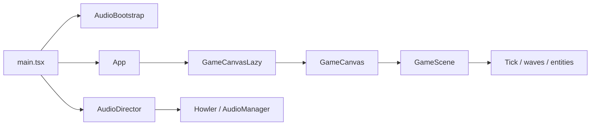

# Architecture (brief)

## Runtime flow

- **`main.tsx`:** React Query provider, `AudioBootstrap` (first pointer gesture: unlock + SFX warm), `AudioDirector` (settings volumes, start/stop battle BGM from `gameStore.status`), `App`.
- **`App.tsx`:** Layout shell, HUD, lazy-loaded **`GameCanvasLazy`** (code-splits Three.js + R3F), victory/defeat modals when a run is active.
- **`GameCanvas.tsx`:** R3F `<Canvas>`, optional dev `Stats`, mounts **`GameScene`**.
- **`GameScene.tsx`:** Environment, grid (placement-only), towers, enemies, camera controls.

## State

- **`gameStore`:** Run lifecycle (`status`, waves, gold, HP, placement, `stageCleared`, `isGameOver`), tower build/upgrade actions, tick-driven updates.
- **`progressStore`:** Stage stars, unlocks, persistence (local + optional cloud merge).
- **`settingsStore`:** Volume, mute, dev FPS overlay; drives **`AudioManager.syncFromSettings`**.

## Audio

- **`AudioManager`:** Howler singleton — BGM lazy until battle starts; SFX lazy until first pointer (warm) or first **`playSfx`** (loads then plays).
- **Assets:** `public/audio/` — `fetch:bgm` downloads Griphop; with **ffmpeg** on PATH the same script (or `compress:bgm`) writes a **~90s, 96kbps** loop to keep MP3 small. WAV remains fallback.

## Cloud

- **`CloudSync.tsx`:** When Supabase is configured (`.env`), syncs **stage progress** and **user settings** with merge UX (`MergeProgressModal`). No extra PII beyond the auth user — see [docs/phases/PHASE-05-CLOUD-SYNC.md](docs/phases/PHASE-05-CLOUD-SYNC.md).

## Key paths

| Area        | Location |
|------------|-----------|
| Game tick  | `src/store/gameStore.ts` |
| Feel / SFX | `src/game/audio/playFeelEvents.ts` |
| Biomes     | `src/game/environment/BiomeEnvironment.tsx`, `src/game/environment/terrain/` |
| Towers     | `src/game/entities/TowerModel.tsx` |

## Performance notes

- **Lazy `GameCanvas`:** Canvas route loads after first paint (spinner in `GameCanvasLazy.tsx`). Vite emits a separate chunk for the lazy module; the main bundle may still hold shared dependencies — see `npm run build` output.
